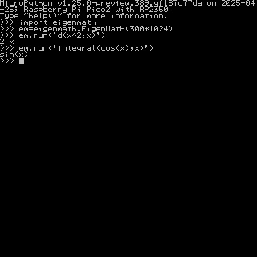

# eigenmath port for micropython




## Firmware for PicoCalc system
### With filesystem
The uf2 file already included file system and main.py, boot.py. Just flash it and remove the usb link to the pico module, tune on the picocalc. 
- **NO FILE COPY NEEDED!! The old file system will be destroyed!**
- picocalc_micropython_ulab_eigenmath_withfilesystem_pico2.uf2 (you could use it with your pico 2 or pico 2w module)
Included ulab, eigenmath port (https://github.com/zenodante/eigenmath_micropython), make picocalc a full function advanced calculator!

## Build Instructions
eigenmath port for micropython, for example, here is the cmake commond for rp2 port.

```sh
cd micropython/ports/rp2
git submodule update --init --recursive
mkdir build && cd build
cmake .. -G "Unix Makefiles" \
  -DUSER_C_MODULES="Path/To/eigenmath_micropython/micropython.cmake;\
  -DMICROPY_BOARD=[TARGET_BOARD] -DPICO_STACK_SIZE=0x6000
```
RPI_PICO2 or RPI_PICO2_W recommonded!


## Credits
Eigenmath https://github.com/georgeweigt/eigenmath